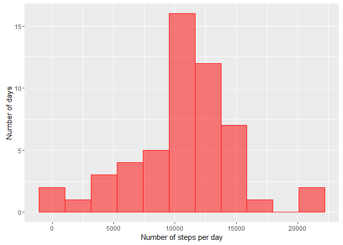
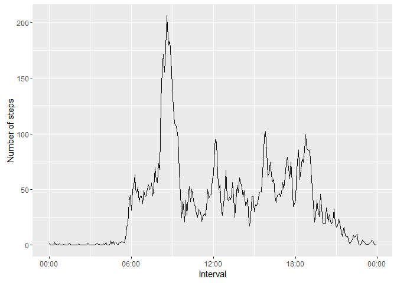
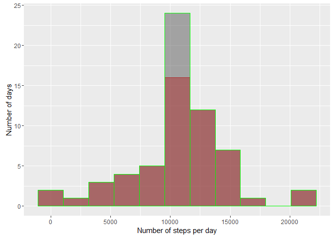
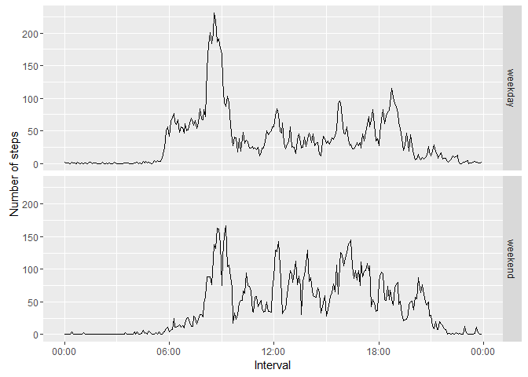

# Reproducible Research: Peer Assessment 1

## Loading the required libraries

```r
library(ggplot2) # for plotting the charts
library(chron) #for dealing with date and time in the dataset
```


## Loading and preprocessing the data
Load the data using the `read.csv` standard function:

```r
a <- read.csv(unz("activity.zip","activity.csv"), stringsAsFactors = FALSE)
```
The data-frame **a** must now contains 17568 observations of 3 variables. Let's check it:

```r
str(a)
```

```
## 'data.frame':	17568 obs. of  3 variables:
##  $ steps   : int  NA NA NA NA NA NA NA NA NA NA ...
##  $ date    : chr  "2012-10-01" "2012-10-01" "2012-10-01" "2012-10-01" ...
##  $ interval: int  0 5 10 15 20 25 30 35 40 45 ...
```
The **date** column is of `character` data type. As we will have to deal with it as a date, let's convert **date** to the `Date` data type, then check the results (we also make certain the TZ is set to something universal so we have no timezone issues): 

```r
Sys.setenv(TZ='UTC')
a$date <- as.Date(a$date,"%Y-%m-%d")
str(a)
```

```
## 'data.frame':	17568 obs. of  3 variables:
##  $ steps   : int  NA NA NA NA NA NA NA NA NA NA ...
##  $ date    : Date, format: "2012-10-01" "2012-10-01" ...
##  $ interval: int  0 5 10 15 20 25 30 35 40 45 ...
```
Let's check the interval variable by looking at the 50 first value:

```r
head(a$interval, 50)
```

```
##  [1]   0   5  10  15  20  25  30  35  40  45  50  55 100 105 110 115 120
## [18] 125 130 135 140 145 150 155 200 205 210 215 220 225 230 235 240 245
## [35] 250 255 300 305 310 315 320 325 330 335 340 345 350 355 400 405
```
What we see here is that the scale is not continuous. We go from 55 to 100 for a 5 minute interval. We need to adjust that so the scale equivalent to a time scale. By looking at the pattern, we see that the last two digit are the minutes from 0 to 55 and that the number for hundreds and probably thousands are the hours as they increment by one after the 55 minutes value. Lets see what appends for a whole day:

```r
ninter <- 24 * 60 / 5 #24h of 60 minutes devided by 5 to get the number of intervals for 1 day
head(a$interval, ninter + 1) #+1 to see what happen after midnight
```

```
##   [1]    0    5   10   15   20   25   30   35   40   45   50   55  100  105
##  [15]  110  115  120  125  130  135  140  145  150  155  200  205  210  215
##  [29]  220  225  230  235  240  245  250  255  300  305  310  315  320  325
##  [43]  330  335  340  345  350  355  400  405  410  415  420  425  430  435
##  [57]  440  445  450  455  500  505  510  515  520  525  530  535  540  545
##  [71]  550  555  600  605  610  615  620  625  630  635  640  645  650  655
##  [85]  700  705  710  715  720  725  730  735  740  745  750  755  800  805
##  [99]  810  815  820  825  830  835  840  845  850  855  900  905  910  915
## [113]  920  925  930  935  940  945  950  955 1000 1005 1010 1015 1020 1025
## [127] 1030 1035 1040 1045 1050 1055 1100 1105 1110 1115 1120 1125 1130 1135
## [141] 1140 1145 1150 1155 1200 1205 1210 1215 1220 1225 1230 1235 1240 1245
## [155] 1250 1255 1300 1305 1310 1315 1320 1325 1330 1335 1340 1345 1350 1355
## [169] 1400 1405 1410 1415 1420 1425 1430 1435 1440 1445 1450 1455 1500 1505
## [183] 1510 1515 1520 1525 1530 1535 1540 1545 1550 1555 1600 1605 1610 1615
## [197] 1620 1625 1630 1635 1640 1645 1650 1655 1700 1705 1710 1715 1720 1725
## [211] 1730 1735 1740 1745 1750 1755 1800 1805 1810 1815 1820 1825 1830 1835
## [225] 1840 1845 1850 1855 1900 1905 1910 1915 1920 1925 1930 1935 1940 1945
## [239] 1950 1955 2000 2005 2010 2015 2020 2025 2030 2035 2040 2045 2050 2055
## [253] 2100 2105 2110 2115 2120 2125 2130 2135 2140 2145 2150 2155 2200 2205
## [267] 2210 2215 2220 2225 2230 2235 2240 2245 2250 2255 2300 2305 2310 2315
## [281] 2320 2325 2330 2335 2340 2345 2350 2355    0
```
This confirm our supposition. Let's convert that to a real proportional time interval by converting it into a `times` object of the *chron* library:

```r
a$interval <- times(((a$interval %% 100) /60 ) + #Minutes in fraction of hours
                     (a$interval %/% 100) # Hours
                    ) / 24 #Fraction of a day
```
It is better now. We have 3 variables:

*  **steps** : An integer value with the number of steps recorded in a 5 minutes interval.
*  **date** : The date on which the measurement was taken.
*  **interval** : A *time* object representing time after midnight when the measurement was taken.

## What is mean total number of steps taken per day?
We will now calculate the mean total number of steps per day. There is two steps to achieve this calculation:

1. Calculate the total number of steps for each day
2. Calculate the mean and median of these totals

Let's start by calculating the total number of steps for each day and have a look at the resulting data-frame :

```r
ts <- aggregate(steps ~ date, data = a,  sum)
str(ts)
```

```
## 'data.frame':	53 obs. of  2 variables:
##  $ date : Date, format: "2012-10-02" "2012-10-03" ...
##  $ steps: int  126 11352 12116 13294 15420 11015 12811 9900 10304 17382 ...
```
Before calculating the mean and median, let's have a look of how the total number of steps per day are distributed:  

```r
ggplot() + geom_histogram(data = ts,aes(steps), bins = 11, fill = "red", color = "red", alpha = 0.5) +
           xlab("Number of steps per day") + ylab("Number of days")
```

<!-- -->
  
The majority of the the total numbers of steps recorded for a given day seems to be around 10000. Let calculate the mean and the median to confirm that:

```r
mean(ts$steps)
```

```
## [1] 10766.19
```

```r
median(ts$step)
```

```
## [1] 10765
```

## What is the average daily activity pattern?
Let's have a look of how the steps are distributed during the day by calculating the average number of steps per 5-minutes intervals and displaying it on a chart (as the date part is irrelevant we use an arbitrary date as our initial midnight):

```r
ms <- aggregate(steps ~ interval, data = a, mean)
ggplot(data = ms) + aes(x = interval,
                        y = steps) +
                    geom_line() +
                    scale_x_chron(format = "%H:%M") +
                    xlab("Interval") +
                    ylab("Number of steps")
```

<!-- -->

We see a spike in the chart. Let's find it's parameters (by using `()` around an assignment `<-` statement, R will also print the assigned value saving us to explicitly print the variable by retyping its name. This is particularly useful when you need to use a variable so you can put value in your text as we do below with the interval and number of steps):

```r
(maxms <- ms[which.max(ms$steps),])
```

```
##     interval    steps
## 104 08:35:00 206.1698
```
So the average maximum number of steps occurs at the interval **08:35:00** with **206** steps on average for that time interval.

## Imputing missing values
There are some missing values in our data-set. This may have an impact on how we should interpret the data. So let's check them. How many NA's do we have:

```r
sapply(a, function(x) sum(is.na(x)))
```

```
##    steps     date interval 
##     2304        0        0
```
So all the NA's are in the steps variable. What is the proportion of missing values in the step variable (as Boolean value are treated as 0 and 1 in calculation, the mean function will give us the proportion of NA's):

```r
(mis.step <- mean(is.na(a$step)))
```

```
## [1] 0.1311475
```
So around 13% of the value are missing. How can we fill in these missing value while minimizing the impact on the rest of the data. 
Let's find out a little more about these NA's. Are they spread in all the data? Are whole days missing ? Are specific intervals being more impacted than others?
Let's calculate the proportion of NA's for each day and have a look of what we have:

```r
na.d <- aggregate(is.na(steps) ~ date, data = a, mean)
summary(na.d)
```

```
##       date             is.na(steps)   
##  Min.   :2012-10-01   Min.   :0.0000  
##  1st Qu.:2012-10-16   1st Qu.:0.0000  
##  Median :2012-10-31   Median :0.0000  
##  Mean   :2012-10-31   Mean   :0.1311  
##  3rd Qu.:2012-11-15   3rd Qu.:0.0000  
##  Max.   :2012-11-30   Max.   :1.0000
```
So the minimum (Min.) is 0, meaning there are days without any missing values and the maximum (Max.) is 1 meaning that some days are full of NA's. Let's count the number of days that are neither full of NA's (1) nor without any NA's (0):

```r
nrow(subset(na.d, `is.na(steps)` != 0 & `is.na(steps)` != 1 ))
```

```
## [1] 0
```
Good news, there are no partial data for any dates. Meaning that only full days of data are missing. How many days of data are missing:

```r
(misday <- sum(na.d$`is.na(steps)`))
```

```
## [1] 8
```
Lets replace these 8 missing days of data by the mean of the other days for the corresponding interval. So basically we will assume that the days were there is no data available, the subject as performed an average day were each the number of steps for each interval is the mean of the days were data are available. We have already calculated the mean value per interval in the data frame **ms** but we will have to round the value to an integer to match the type of the other steps values:

```r
af <- merge(a, ms, by = "interval") # Add a column with the mean for the corresponding interval
af$steps.x <- ifelse(is.na(af$steps.x),as.integer(round(af$steps.y)), # replace NA's by the mean
                                       af$steps.x
                     )
af <- af[,c(2,3,1)] # drop the mean columns and reoder as in the original dataframe
colnames(af)[1] <- "steps" #rename the columan as in the original dataframe
```
Let's check if we still have missing values:

```r
sum(is.na(af$steps))
```

```
## [1] 0
```
Good. Now let's compare the total steps per days before and after filling in the missing value

```r
tsf <- aggregate(steps ~ date, data = af,  sum)
ggplot() + geom_histogram(data = ts ,aes(steps), bins = 11, color = "red", alpha = 0.5, fill = "red") +
           geom_histogram(data = tsf,aes(steps), bins = 11, color = "green", alpha = 0.5) +
           xlab("Number of steps per day") + ylab("Number of days")
```

<!-- -->

By overlaying the two histograms (original in red and, the one where NA has been filled with border in green and fill in gray), we can see that the number of days where the number of steps are all identical but for one bin. The central bin is now higher. 
Let's compare the means and medians:

```r
matrix(c(mean(ts$steps),   mean(tsf$steps),
         median(ts$steps), median(tsf$steps)),
       nrow = 2, 
       dimnames = list(c("Original (ts)", "Na Replaced (tsf)") ,
                       c("mean","median")
                       )
       )
```

```
##                       mean median
## Original (ts)     10766.19  10765
## Na Replaced (tsf) 10765.64  10762
```

The means and medians are practically identical. So filling in the missing value with the same interval means had nearly no impact on the overall mean or median for the days. This seems logical, the days we added where *mean* day so they impacted the number of *mean* days. There are 8 more in the central bin which correspond to the days where data was missing and that have been filled with data from a *average* day.

## Are there differences in activity patterns between weekdays and weekends?
First we need to add a variable to differentiate week days from weekend days then calculate the average number of steps per interval for the week days and weekend days separately:

```r
af$wd <- as.factor(ifelse(weekdays(af$date) %in% c("Saturday","Sunday"),"weekend","weekday"))
mswd <- aggregate(steps ~ interval + wd, data = af, mean)
```

Finally we compare the average number of steps during the day for the week days and weekend days :


```r
ggplot(data = mswd) + aes(x = interval,
                          y = steps) +
                      geom_line() +
                      scale_x_chron(format = "%H:%M") +
                      xlab("Interval") +
                      ylab("Number of steps") +
                      facet_grid("wd ~ .")
```

<!-- -->

Looks like we are walking less in the beginning of a day during weekend than during the rest of the week and more in the afternoon.
